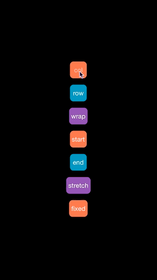

# FlexboxKit
A simple UIKit extension to wrap the flexbox properties in regular *UIView*. This project is based on the robust Facebook's C implementation of Flexbox.

The goal is to have a small standalone **UIKit** library to layout elements. It doesn't rely on the DOM model at all.


<p align="center">



#Usage

The easiest way to use the flexbox layout facilities is to instantiate a `FLEXBOXContainerView`, set its flexbox properties (as exposed in the *UIView* category `UIVIew+FLEXBOX`), add all the 
subviews you want to it and additionaly set their flex properties.

If you have subviews which themselves will have subviews that you wish to layout using the flexbox engine, you simply have to set the *UIView* category property `flexContainer` to `YES`, and so on. You can also have nested `FLEXBOXContainerView`s.

e.g. Given a view (in this case a *UITableViewCell*) with these subviews:

```Objective-C

FLEXBOXContainerView *contentView;
UIView *left, *right;
UILabel *title, *caption;

...

[contentView addSubview:left];
[contentView addSubview:right];
[contentView addSubview:time];

[right addSubview:title];
[right addSubview:caption];

``` 

The following flexbox layout code

```Objective-C

contentView.flexDirection = FLEXBOXFlexDirectionRow;

left.flexFixedSize = (CGSize){A_FIXED_SIZE, A_FIXED_SIZE};
left.flexMargin = (UIEdgeInsets){SOME_MARGIN, SOME_MARGIN, SOME_MARGIN, SOME_MARGIN};
left.flexAlignSelf = FLEXBOXAlignmentCenter;

rigth.flexContainer = YES;
right.flex = 1;
right.flexJustifyContent = FLEXBOXJustificationCenter;

time.flexMargin = (UIEdgeInsets){SOME_MARGIN, SOME_MARGIN, SOME_MARGIN, SOME_MARGIN};
time.flexPadding = (UIEdgeInsets){SOME_PADDING, SOME_PADDING, SOME_PADDING, SOME_PADDING};
time.flexAlignSelf = FLEXBOXAlignmentCenter;

``` 
Results in:

<p align="center">


##Advanced usage

You can use **FlexboxKit** without using `FLEXBOXContainerView` by simply having a `-[UIView layoutSubviews]` implementation that calls the `-[UIView flexLayoutSubviews]` method defined in the *UIView* category `UIVIew+FLEXBOX`.

e.g.

```Objective-C

- (void)layoutSubviews
{
    [super layoutSubviews];
    [self flexLayoutSubviews];
}


``` 

If you wish to run the layout engine on a **background thread** you can do so by calling 
`[node layoutConstrainedToMaximumWidth:self.bounds.size.width]` in a background thread and then set the computed frames in the main thread.

e.g.

```Objective-C

- (void)flexLayoutSubviewsInBackground
{
    __weak __typeof(self) weakSelf = self;
    dispatch_async(dispatch_get_global_queue(DISPATCH_QUEUE_PRIORITY_HIGH, 0), ^{
        
        __strong __typeof(self) strongSelf = weakSelf;

        //run the flexbox engine on a backgroun thread...
        strongSelf.flexNode.dimensions = strongSelf.bounds.size;
        [strongSelf.flexNode layoutConstrainedToMaximumWidth:strongSelf.bounds.size.width];
        
        dispatch_async(dispatch_get_main_queue(), ^{
            
            //assign the computed frames on the main thread...
            for (NSUInteger i = 0; i < strongSelf.flexNode.childrenCountBlock(); i++) {
                
                UIView *subview = self.subviews[i];
                FLEXBOXNode *subnode = strongSelf.flexNode.childrenAtIndexBlock(i);
                subview.frame = CGRectIntegral(subnode.frame);
            }
            
            strongSelf.frame = (CGRect){strongSelf.flexNode.frame.origin, strongSelf.flexNode.frame.size};
        });
        
    });

}

``` 


# Attribuitions 
It uses Facebook's [flexbox implementation][css-layout] and was inspired by Josh Abernathy's
[SwiftBox] and Robert Böhnke's [FLXView].

[css-layout]: https://github.com/facebook/css-layout
[swiftbox]: https://github.com/joshaber/SwiftBox
[flxview]: https://github.com/robb/FLXView
